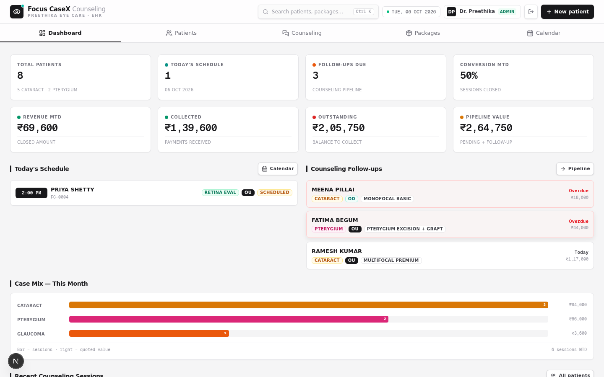

# FOCUS*CASEX — Counseling & Surgery Coordination EHR

A sharp, keyboard-fast clinic management app for an eye-care practice: patient registry, vision records, counseling pipeline, surgery planning, IOL lens stock, package pricing and a calendar — in one brutalist, no-chrome interface.

> Built for **Preethika Eye Care**. Sharp boxes, hard shadows, mono data. Every eye. Every case. One record.



## Features

- **Patient registry** — MRN auto-generation (PEC-0001…), cataract / pterygium eye flags, comorbidities, referral source, full edit support
- **Vision records** — VA, IOP, refraction (SPH / CYL / AXIS) per eye with history
- **Lens details (biometry & IOL plan)** — per-eye K1/K2 readings with computed Avg K, planned IOL picked from live stock (A-constant auto-fills, stays editable), chosen lens
- **Counseling sessions** — procedure / eye / package / quote / payment / willingness pipeline with follow-up tracking
- **Surgery tab** — pre-op workup (BP, blood sugar, axial length, K readings, IOL power), planned vs placed lens chips, lens stock decrement on placement
- **Lens stock** — tracked per model / power / batch with expiry + low-stock alerts; catalog rows double as pickable lens models before real lots arrive
- **Packages** — component-based pricing builder with discount → final price
- **Calendar** — day / week / month views, jump-to-today, procedure-colored appointments
- **Role gate** — `ADMIN` sees ₹ amounts and can manage lens stock & packages; `STAFF` gets the full clinical workflow with money hidden
- **Global search** — patients + packages from anywhere (⌘K)

## Stack

| Layer      | Tech                                                  |
| ---------- | ----------------------------------------------------- |
| Framework  | Next.js 16 (App Router, React Compiler, standalone)   |
| Database   | PostgreSQL (Supabase) via Prisma — SQLite for local dev |
| Auth       | Cookie + Bearer sessions, scrypt password hashes      |
| Styling    | Tailwind CSS 4 + shadcn/ui, brutalist design system   |

## Quickstart (local dev — SQLite, zero setup)

```bash
bun install
cp prisma/schema.sqlite.prisma prisma/schema.prisma   # SQLite variant for local dev
cp .env.example .env          # default DATABASE_URL points at ./db/custom.db
bun run db:push               # create tables
bun scripts/seed.ts           # 2 login accounts + 29-lens clinic catalog
bun run dev                   # http://localhost:3000
```

**Login accounts** — the repo never ships passwords. Set env vars to choose them:

```bash
ADMIN_PASSWORD="your-admin-password" STAFF_PASSWORD="your-staff-password" bun scripts/seed.ts
```

Without env vars, re-running the seed leaves existing accounts untouched; a brand-new account gets a generated one-time password printed to the console.

## Production setup — Supabase

1. Create a project at [supabase.com](https://supabase.com) (or use the existing one).
2. **Schema** — open Dashboard → SQL Editor → New query, paste the whole of [`supabase/schema.sql`](supabase/schema.sql), Run.
   It creates all 9 tables with foreign keys **and enables Row Level Security on every table** (no policies → the publishable key grants zero data access; all traffic goes through the app's API layer).
3. **Seed the lens catalog** — paste [`supabase/seed.sql`](supabase/seed.sql), Run. Seeds the clinic's real 29-lens catalog only — **no mock data, no password hashes** (login accounts are created in step 4).
4. **Connect the app & create accounts** — Project Settings → Database → Connection string (session pooler, port 5432), then:

   ```bash
   export DATABASE_URL="postgresql://postgres.<project-ref>:<DB-PASSWORD>@aws-0-<region>.pooler.supabase.com:5432/postgres"
   bun run db:generate
   ADMIN_PASSWORD="…" STAFF_PASSWORD="…" bun scripts/seed.ts   # login accounts + lens catalog
   bun run build && bun run start
   ```

   (`prisma/schema.prisma` already targets PostgreSQL — no file swap needed.)

5. **Deploy** — any Node host works (Vercel, Fly, Railway, Render, VPS). Set `DATABASE_URL` as a secret env var; `NEXT_PUBLIC_SUPABASE_URL` and `NEXT_PUBLIC_SUPABASE_PUBLISHABLE_KEY` are client-safe.

   > **Note** — Focus CaseX is a full-stack Next.js app (API routes + Prisma + cookie sessions), so static hosts like GitHub Pages cannot run it. Use a Node platform and point `DATABASE_URL` at Supabase.

   | Variable                    | Required   | Purpose                                                     |
   | --------------------------- | ---------- | ----------------------------------------------------------- |
   | `DATABASE_URL`              | yes        | Supabase session-pooler connection string (PostgreSQL)      |
   | `NEXT_PUBLIC_SUPABASE_URL`  | no         | Client-safe Supabase project URL                            |
   | `NEXT_PUBLIC_SUPABASE_PUBLISHABLE_KEY` | no | Client-safe publishable key (RLS-locked, reads nothing)  |
   | `ADMIN_PASSWORD` / `STAFF_PASSWORD` | seed only | Login passwords when running `scripts/seed.ts`      |

   Build & run (`output: standalone`):

   ```bash
   bun run build   # next build → copies static assets into .next/standalone
   bun run start   # node .next/standalone/server.js  (PORT/HOSTNAME aware)
   ```

## Security notes

- The **publishable key** is safe to expose — `supabase/schema.sql` enables RLS on every table with **no policies**, so it can read or write nothing.
- **Secrets never live in the repo**: database password, service-role key and login passwords are all env-only. `.env` files are gitignored; only `.env.example` (placeholders) is committed.
- Passwords are stored as scrypt hashes (`salt:hash`); sessions are DB-backed tokens with expiry.
- Lens stock & package management are ADMIN-gated at the API layer; money fields are stripped from STAFF responses.

## Project structure

```
prisma/                 schema.prisma (PostgreSQL / Supabase — active) · schema.sqlite.prisma (local dev variant)
supabase/               schema.sql + seed.sql — run once in the Supabase SQL Editor
src/app/api/            REST API — patients, vision, sessions, appointments, lenses, packages, stats, auth
src/components/focuscasex/  app shell + tabs (dashboard, patients, counseling, surgery, lenses, packages, calendar)
scripts/                seed.ts (real baseline) · apply-supabase.ts · cleanup-mock-data.ts · DB helpers
```

## Data policy

The database ships **empty of mock data** — the seed only creates login accounts and the clinic's real lens catalog. Every patient, session, appointment and package is entered live through the UI and stays yours.
